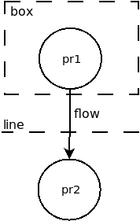

# Base Threat Model

The OdTM base threat model is an OWL ontology.
It enables semantic interpretation of DFD diagrams and automatic building of threat/countermeasure lists by reasoning features.
It contains basic concepts and individuals, representing components of DFD diagrams, threats, countermeasures, and their properties.

* [OWL file](../OdTMBaseThreatModel.owl)

## Semantic interpretation of DFD diagrams

A simple DFD diagram looks like:

