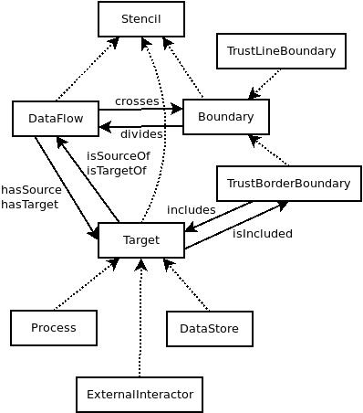
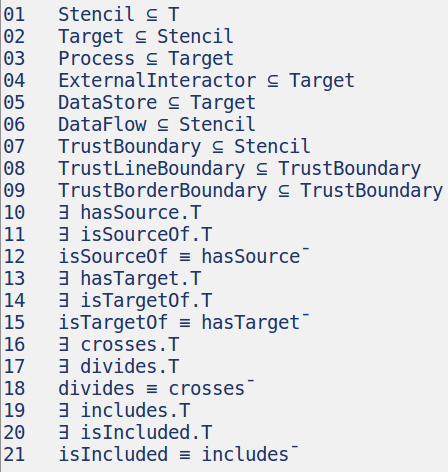
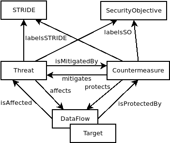
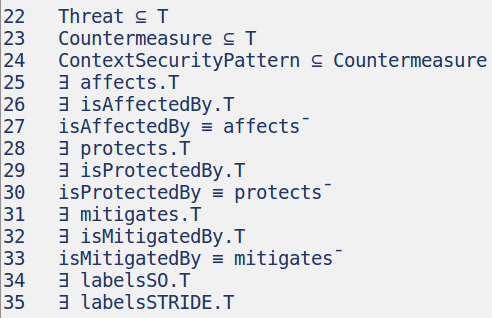
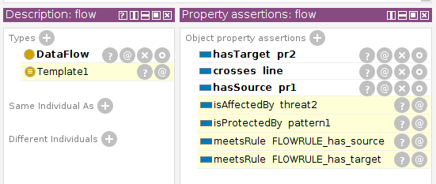

# Base Threat Model

The OdTM base threat model is an OWL ontology.
It enables semantic interpretation of DFD diagrams and automatic building of threat/countermeasure lists by automatic reasoning procedures.
It contains basic concepts and individuals, representing components of DFD diagrams, threats, countermeasures, and their properties.

* [OWL file](../OdTMBaseThreatModel.owl)

## Structure

Stencils and their properties:



DL "axioms" that represent this picture:



Threats and countermeasures:



The sentences for this part of the ontology:



## Example


A simple threat model looks like:

```
Template1 ≡ DataFlow ∩ ∃hasSource.Process ∩ ∃hasTarget.Process ∩ ∃crosses.TrustLineBoundary
ContextSecurityPattern(pattern1)
Template1 ⊆ ∃isProtectedBy.{pattern1}
Threat(threat2)
Template1 ⊆ ∃isAffectedBy.{threat2}
```

A simple DFD diagram looks like:


Using DL it possible to define this picture as

```
Process(pr1)
Process(pr2)
DataFlow(flow)
hasSource(flow, pr1)
hasTarget(flow, pr2)
TrustLineBoundary(line)
crosses(flow, line)
TrustBorderBoundary(box)
includes(box, pr1)
```

After putting all the DL items to OWL and combining with the base model and reasoning in Protege it might look like:




