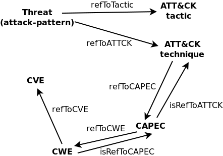
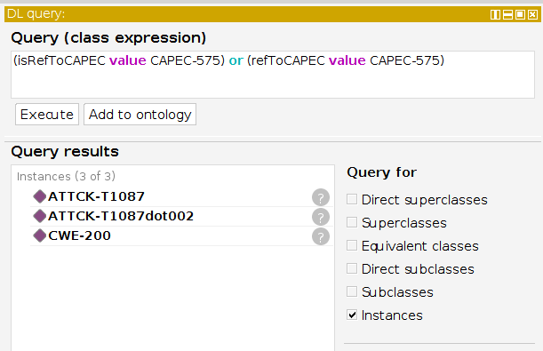
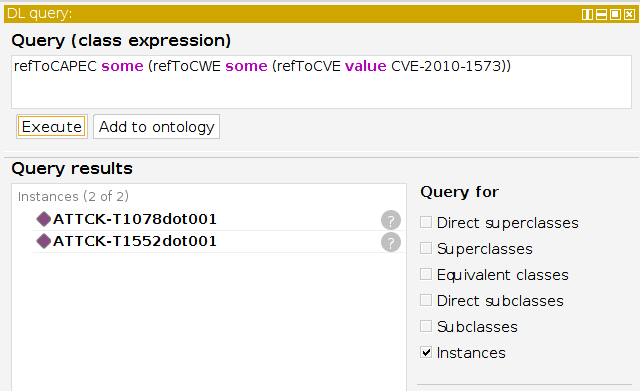
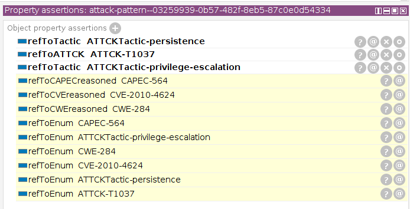
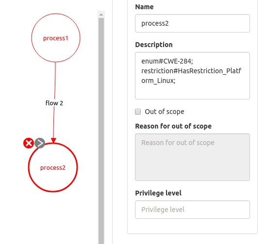

# Integrated model of security enumerations

This model is an ontological domain-specific threat model
that unites ATT&CK (Enterprise Matrix), CAPEC, CWE, and partially CVE.
The model can be used to learn relations between attack patterns, weaknesses, and vulnerabilities, 
evaluate the quality of such links, and to build various threat landscapes.

* [OWL file](../OdTMIntegratedModel.owl) - contains the ontology in the functional syntax.
* [Clear RDF](../applications/generateIM/ttl/OdTMIntegratedModel.ttl) - contains the same data in the RDF format.
* [Reasoned RDF](../applications/generateIM/ttl/OdTMIntegratedModel_filled.ttl) - contains the inferred dataset.

The structure of the relations is shown in the figure:

Both the root concept 'Threat' and the 'ATTCKTechnique' concept represent 
the [ATT&CK techniques](https://github.com/mitre-attack/attack-stix-data).

The ['CAPEC'](https://capec.mitre.org) concept represents another kind of attack patterns, taken from an XML file.

The ['CWE'](https://cwe.mitre.org) concept indicates entities of the weakness enumeration, which are provided by an XML file.

Also, CWEs refer to [CVEs](https://www.cve.org/). So, the knowledge base has only CVEs mentioned in the CWE enumeration.

## Use of linked enumerations

Example of looking entities that are 'parents' and 'children' for a given CAPEC instance:

Example of finding relevant techniques to a given CVE entity:

A set of property chains (refToATTCK, refToCAPECreasoned, refToCWEreasoned, and refToCVEreasoned) 
and the 'refToEnum' subproperty allow to map patterns, weaknessess, and vulnerabilities to techniques:

## Use in DFD based threat modeling 

There is a trend of creation various ratings of attack patterns, weaknesses, and vulnerabilities, 
like [Top 25 CWEs](https://cwe.mitre.org/top25/). 
With a diagram it can be possible to map particular CAPECs or CWEs to a system item in order 
to learn possible attack techniques. 

For example, to examine the item with CWE-284, it can be labeled as 'enum#CWE-284'. 
During modeling process a special defined class is created that catches all the threats 
that have the 'refToEnum value CWE-284' property.
After applying this class, a reasoner should start one more time to have the threats, 
associated with labeled component.

An example of labeling:

Results are like:

The JSON files of that case (and other ones) [are here](applications/generateIM/cases/).

More details about the model (and ATT&CK centric threat modeling) can be found in [this publication](https://www.researchgate.net/publication/356869652_Towards_automation_of_threat_modeling_based_on_a_semantic_model_of_attack_patterns_and_weaknesses).

To cite the model:
>Brazhuk A. Towards automation of threat modeling based on a semantic model of attack patterns and weaknesses // arXiv preprint arXiv:2112.04231 . – 2021.

