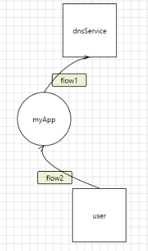
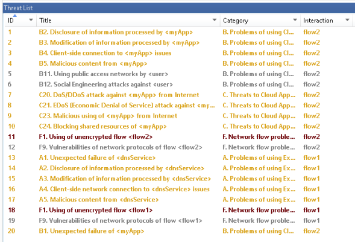
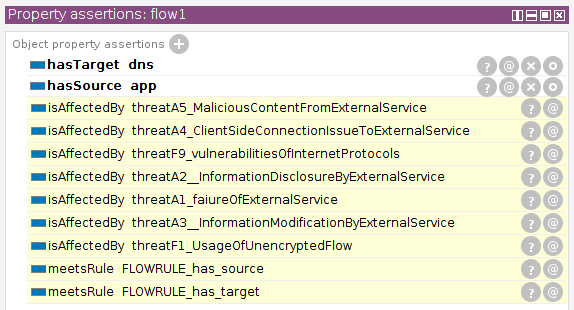
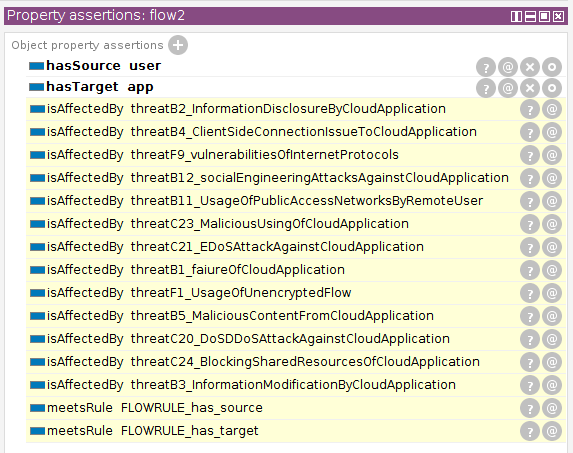

/[ . . ](../README.md)/

# Common Cloud Computing Threat Model (CCCTM)

This model is an example of domain-specific threat model. 
It depicts some common threats to cloud systems.
The model is implemented as a OWL ontology.

It can be used to test ontological tools, when they are under heavy development, also to prove different ideas (see below).

There is also the similar model, 
implemented as a [threat template](https://github.com/nets4geeks/CCCTM_template) in the XML format for the Microsoft TM tool.

* [OWL file](../OdTMCCCTM.owl)

Note, that it does not have a countermeasure hierarchy.


## Proof of concept

To create such a picture, you would use the [CCCTM template](https://github.com/nets4geeks/CCCTM_template), 
implemented as XML and the [Microsoft Threat Modeling (TM) tool](https://aka.ms/threatmodelingtool):



and you would get a list in Microsoft TM:



But there is a better option. You can interpret a DFD as DL axioms ...

```
ExternalService (dns)
CloudService (app)
RemoteUser (user)
ApplicationFlow (flow1)
hasSource (flow1, app)
hasTarget (flow1, dns)
ApplicationFlow (flow2)
hasSource (flow2, user)
hasTarget (flow2, app)
```

and put them as OWL into Protege with CCCTM, implemented as the ontology, 
add the [base model](../OdTMBaseThreatModel.owl), enable a reasoner, and obtain the similar results:






/[ . . ](../README.md)/

