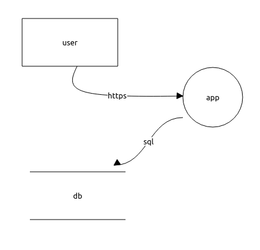
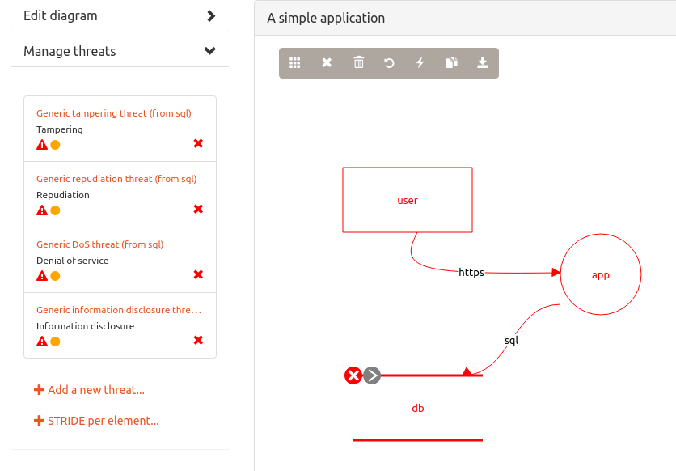
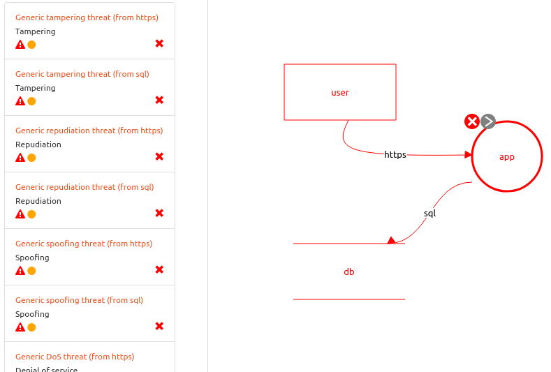

# Lab1: Introduction to the ontology-driven threat modeling

### Starting threat modeling...

The classic approach to threat modeling is based on [Data Flow Diagrams (DFD)](https://www.google.com/search?q=Shostack+A.+Experiences+Threat+Modeling+at+Microsoft).
Also several [other techniques](https://insights.sei.cmu.edu/sei_blog/2018/12/threat-modeling-12-available-methods.html) exist.

You can use the [OWASP Threat Dragon](https://github.com/OWASP/threat-dragon-desktop/releases) desktop application 
to manage threat models, apply mitigations, and create reports (there is [its documentation](https://docs.threatdragon.org/)).
Threat Dragon has a built-in threat rule engine, supporting the STRIDE, CIA, LINDDUN techniques.
However, we use here original ontology-driven approach, based on domain-specific threat models, 
and implemented by own [OdTMServer](instruction.md) application.

So, there is a simple computer system.
It includes a web application (process) and background database (storage).
Also, users of this system (external entities) should be taken into account.
A user communicates with the application by the HTTPS protocol,
and the application and database interact by the SQL protocol.

To examine security aspects of the system, a simple DFD has been created:

After processing by OdTMServer, the [threat model](models/lab1_example1_modelled.json) (**Example1**)is like
(for, example the 'db' item in the picture can be affected by the tampering, repudiation, denial of service, 
and information disclosure threats):

Also, it can be found, that the 'app' component has double number of the STRIDE threats, 
because it has two flows (for example, denial of service of 'app' can be caused by the 'user' item with the 'https' flow,
as well as by 'db' with 'sql'):

Note, the ontology-driven threat modelling framework is focused on the network communications.
Every data flow represents a network connection from a client (edge without arrow) to a server (edge with arrow).
Such a connection is bidirectional, and you do not have to create a flow from the server to client
(but this should be taken into account).

### ...and applying the cloud threats

Example1 shows how the ontological approach works. Our rule engine has 'taken' the STRIDE threats 
from the [base threat model](../docs/BASEMODEL.md), which is an OWL (Web Ontology Language) ontology. 
Actually, that has been a result of reasoning of semantic interpretation of DFD (ontology too), e.g. ABox (Assertion Box),
and the base threat model, e.g. TBox (Terminology Box).
An introduction to Ontology Engineering [can be found here](https://people.cs.uct.ac.za/~mkeet/OEbook/)
(if you really interested in).

## Assignments

## Self-testing

* What is threat modeling?
* What approaches are used for the threat modeling?
* Which items can a data flow diagram consist of?
* What is STRIDE?
* What benifits does STRIDE-per-element provide?

