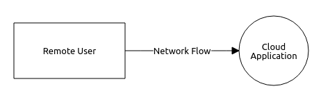
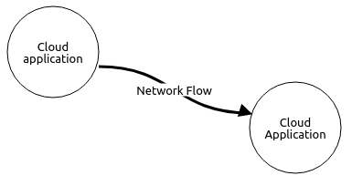
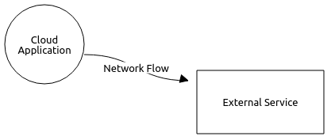
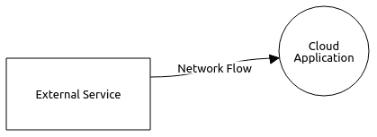

/ [main](README.md) /

# Lab2: Modeling of the cloud architecture threats

### Overview

The effective use of the cloud threat patterns requires some understanding of security issues 
and a bit of experience with design challenges.
We propose a set of design primitives to better tackle and learn these challenges by inexpert users.
Learning these primitives in advance enables better understanding security aspects of a diagram 
that represents a whole design of a cloud system.

Three design primitives that touch the architecture aspects are described below.

### Primitive1: Simple cloud application

The simplest use case of a cloud application is represented by interaction of remote users with the application.

From the network perspective the remote users are treated as clients and the cloud application is a server.
And an application protocol (e.g. HTTPS) based on TCP/IP can be used for the data transmission.

Cloud application as a server can affect remote users (as well as other entities acting as clients, 
like another cloud application or external service).
An example of common threats (the **ABxx** group in ACCTP) is [AB01 Failure Of Cloud Application](https://nets4geeks.github.io/acctp/catalog/threatAB01_FailureOfCloudApplication.html). 
The **ACxx** group represents threats specific to remote users, like [AC01 Malware From Cloud Application](https://nets4geeks.github.io/acctp/catalog/threatAC01_MalwareFromCloudApplication.html).

Clients (remote users, cloud application, external services) can affect the cloud application.
The **ADxx** group contains common threats, like [AD01 Broken Authentication](https://nets4geeks.github.io/acctp/catalog/threatAD01_BrokenAuthentication.html).
And the **AExx** group is about the threats produced by remote users, like [AE01 DDoS Attack To Cloud Application](https://nets4geeks.github.io/acctp/catalog/threatAE01_DDoSAttackToCloudApplication.html).

### Primitive2: Interaction of cloud applications

A cloud application often has several components, like frontend (web application) and backend (database or storage).
These components both influence earch other from the security point of view.

The threats regarding this primitive are in the **ABxx** and **ADxx** groups (see examples above).

### Primitive3: Interaction with external services

A cloud application can use services, described as external, i.e. "as it is" or with weak agreement between
service and customer (network flow from the Cloud Application to the External Service).

This case (the use of the external service by the cloud application) is described by the **AAxx** group of threats.
An example can be [AA05 Spoofing Of Remote Service](https://nets4geeks.github.io/acctp/catalog/threatAA05_SpoofingOfRemoteService.html). 

And there is a case of the cloud application usage by an external service (External service to Cloud application).

The use of cloud applications is shown by the **ABxx** and **ADxx** groups, mentioned above. 

## Assignments

* to do

## Self-testing

* to do

/ [main](README.md) /
