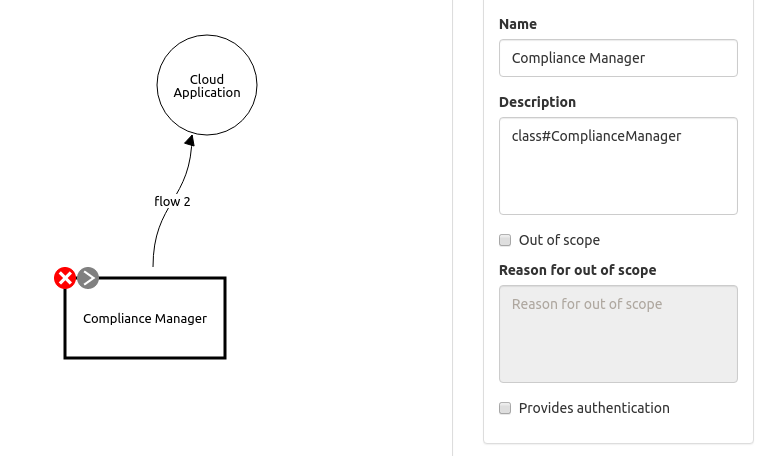

/ [main](README.md) /

# Lab3: Modeling of the compliance challenges of cloud systems

### Overview

Loss of governance is a generic challenge that users meet planning the placement of their applications into a cloud.
Traditional infrastructures allow the use of various security means,
however cloud environments restrict utilization most of the technical controls.
Owners of cloud applications are forced to share their responsibility with other stakeholders,
like cloud and network providers, service brokers etc.
Often cloud services are based on advanced and implicit supply chains.

Many cloud specific threats can be mitigated by compliance-like controls.
Cloud customers should use two ways to reduce the influence of such threats: applying of appropriate security metrics
in SLA (Service Level Agreement) and monitoring of the metrics.
Several specifications and projects define security-related metrics, like FIPS 200, ISO/IEC 19086-2, A4Cloud, SPECS.
And that is still a challenge to implement effective monitoring of the security SLA metrics.

The [ACCTP catalog](https://nets4geeks.github.io/acctp/catalog/) has a set of threats,
dedicated to the compliance aspects of cloud security. This set is labeled as the *BXXX* threats.

### Enable compliance threats

There is a special concept, called 'ComplianceManager', used to manage the compliance threats.

If you want to consider such threats,
apply to a diagram a compliance manager instance and connect it as a client with a target application.

Threat model of that primitive can be found in [this example](models/lab3_example_modelled.json)

## Assignments

* Enumerate with a table main security challenges, related to placement of an application in a cloud (3-5 records).
To each challenge apply a list of possible threats and a list of possible mitigations.

* Learn the BXXX threats in the [ACCTP catalog](https://nets4geeks.github.io/acctp/catalog/).
In a table apply to each one the CIA (Confidentiality, Integrity, Availability) labels. 

## Self-testing

* What are kinds of stakeholders in cloud environment according [NIST Cloud Computing Reference Architecture](https://nvlpubs.nist.gov/nistpubs/Legacy/SP/nistspecialpublication500-292.pdf)?
* Explain a problem of supply chain in cloud environment (from security point of view).
* Explain a problem of lock-in of cloud provider.
* What security controls can be implemented by PaaS cloud provider? Put them in priority order.
* What security controls can be implemented by IaaS cloud provider? Put them in priority order.

/ [main](README.md) /
