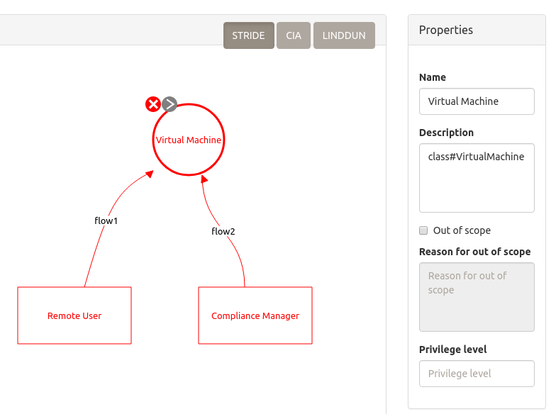

/ [main](README.md) /

# Lab5: Modeling of the IaaS clouds

### Overview

Common management entities of the IaaS (Infrastructure as a Service) layer are known as Virtual Machines (VMs).
VMs give more flexibility to choose underlying system software (like an operating system, network services) for cloud customers.
However, this requires more accurate handling and extra security efforts from cloud architects and developers.

### The IaaS design primitive

Applying the IaaS threats with the ontology driven approach includes two steps.
Firstly, you should consider cloud applications as virtual machines (the "class#VirtualMachine" label).
Secondly, to enable the compliance aspects put a compliance manager instance in a diagram and connect it to a VM.

The IaaS design primitive is shown in the picture:

A threat model of that primitive can be found in [this example](models/lab5_example_modelled.json)

Note, to enable a systematic approach both common cloud threats and IaaS specific threats should be accurately studied
for the virtual machine stencil (due to inheritance of the threats of the "CloudApplication" concept).
Very often to achieve this, it needs to consider a bunch of threats, caused even by a simple case.
So, you have to apply a threat prioritization strategy, or create several diagrams,
depicted separately architectural, compliance, and privacy aspects.

## Assignments

* Using Threat Dragon, learn the [DXXX](https://nets4geeks.github.io/acctp/catalog/) threats 
of the virtual machine from [this example](models/lab5_example_modelled.json),
apply valuable mitigations (from your point of view) to them (3-5 mitigations to each threat), 
and save a report as a PDF file.

* A use case includes a virtual machine with a web application, and two background systems: 
a cloud file storage, and a nosql database, the latter is implemented as a VM.
Using Threat Dragon, create two diagrams: first one for depiction of architectural threats, 
second one to consider compliance threats. Save them to separate JSON files.

## Self-testing

* What mitigations can be applied against remote code execution at the OS layer and at the web application layer?
* What is the Cross-VM Side Channel attack?
* Evaluate the probability of the VM Escape threat for an education cloud realm and a state energy cloud system.
* Enumerate well-known cases of hypervisor vulnerabilities (3-5 examples).

/ [main](README.md) /
